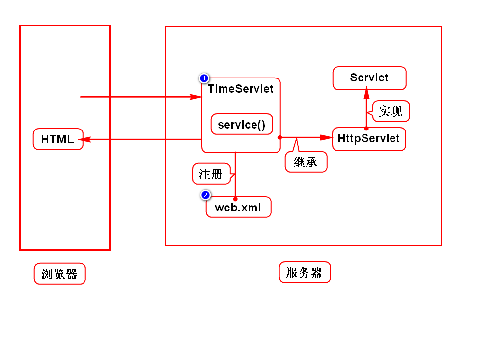

# WEB应用的演变
## 规律
1. 从单机向网络演变
2. 从CS向BS演变

## 解释
### CS(Client Server)
客户端服务器程序，即客户端需要单独开发和安装

### BS(Browser Server)
浏览器服务器程序，即使用浏览器充当客户端

# Servlet
## 服务器如何给浏览器发送网页？
### 静态网页
- 新闻页、百度百科
- 服务器保存一份HTML，发送给浏览器即可

### 动态网页
- 淘宝页、微博
- 服务器保存一个组件，动态拼一个HTML发送给浏览器
- 在Java中该组件就是Servlet

> 组件就是满足规范的对象

## Servlet特征
- 部署在服务器上
- 可以用来动态拼资源(HTML/img)，即处理HTTP协议
- 必须满足Sun的规范

> 部署就是拷贝的术语

## 什么是Servlet
Servlet是Sun推出的，
用来在服务器端处理HTTP协议的组件

# 服务器
## 名称
- Java服务器
- WEB服务器
- Java WEB服务器
- Servlet容器

## 本质
- 是一个可以运行Java项目的软件
- 和浏览器平级

## 举例
- Tomcat
- JBoss
- WebLogic
- WebShpere

# Tomcat的使用
## 一、直接使用(上线时)
### 1.下载及安装
- 在Tomcat官网下载压缩包
- 绿色版解压缩后可用
> 学生机上已经安装好了/tts9/apache-tomcat-7

### 2.配置环境变量
- 配置JAVA_HOME
> 学生机上已经配置好了

### 3.启动Tomcat
- Linux：打开/tomcat/bin，终端输入./startup.sh
- Windows：打开/tomcat/bin，双击startup.bat
> 加权限：chmod +x *sh

### 4.访问Tomcat
- 在浏览器上访问: http://localhost:8080
- 看到一只猫着代表成功了

### 5.关闭Tomcat
- Linux：打开/tomcat/bin，终端输入./shutdown.sh
- windows：打开/tomcat/bin，双击shutdown.bat

## 二、用Eclipse运行Tomcat(开发时)
- 参考http://doc.tedu.cn/tomcat

## 端口被占用问题
### 错误信息
- Address already in use, JVM_BIND 8080

### 重复启动Tomcat
- 强制关闭Tomcat，即手动shutdown

### 其他软件占用端口(Oracle)
- 解决方案：修改Tomcat端口
- 修改/tomcat/conf/server.xml，65行port="8080"
- 修改/servers/server.xml，和上面文件一样

# Servlet开发步骤
## 1.创建WEB项目
- WEB目录：/webapp/WEB-INF/web.xml

## 2.导入jar包
- 通过maven搜索javaee导入
- 使用Tomcat自带的javaee包
> 右键项目->properties->targeted runtime->勾选tomcat

## 3.写Servlet
- 实现Servlet接口
- 继承与HttpServlet

## 4.注册Servlet
- 在web.xml中进行注册
- 注册此Servlet
- 给Servlet注册一个访问路径(网名)

## 5.部署项目
1. 选择Servers/tomcat7，右键Add and Remove
2. 将左侧要部署的项目移动到右侧，Finish
3. 启动Tomcat

# Servlet运行过程及报错情况

# HTTP协议
## 作用
规定了浏览器和服务器如何通信及数据格式。

## 如何通信
1. 建立连接
2. 发送请求
3. 接收响应
4. 关闭连接
> 一次请求一次连接，降低服务器压力

## 数据格式
### 请求数据
1. 请求行：基本信息
2. 消息头：数据的描述信息
3. 实体内容：数据

### 响应数据
1. 状态行：基本信息
2. 消息头：数据的描述信息
3. 实体内容：数据

## 对开发的要求
### 不需要开发的地方
- 通信的步骤已经由浏览器和服务器实现了
- 请求数据的打包由浏览器实现
- 响应数据的打包由服务器实现

### 需要开发的地方
- 请求数据的内容由开发提供
- 响应数据的内容由开发提供
- 开发使用request接收请求数据
- 开发使用response发送响应数据