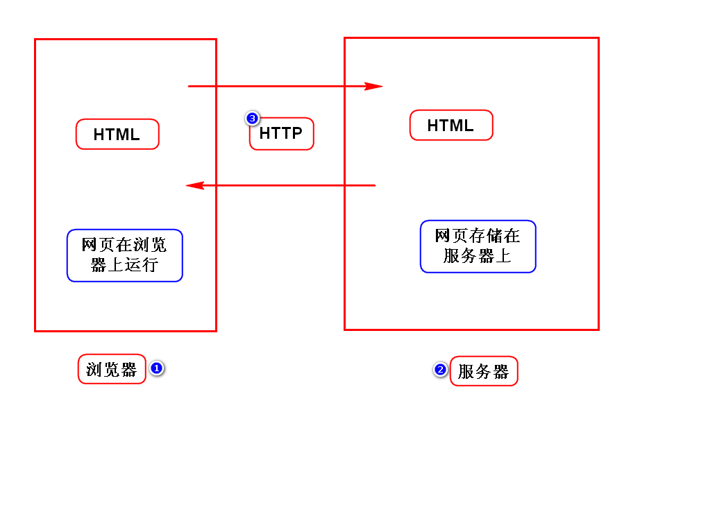

李洪鹤/lihh@tedu.cn

# Java体系结构

# Web基础课程介绍
## 构成
1. HTML：勾勒出网页的内容和结构
2. CSS：美化页面
3. JS：可以让页面呈现动态的数据和效果

## 目的
1. 教会大家如何做网页
2. 绝大部分的Java程序员开发WEB项目

# Web三要素

# XML和HTML对比
## XML
- 可扩展标记语言：标签、属性、关系可扩展
- 用来存储或传输数据

## HTML
- 超文本标记语言：标签、属性、关系已固定(w3c)
- 用来显示数据
- 某些版本就是按照XML规范定义的
- 可以将HTML理解为标签固定的XML

# 表格

# 英雄联盟

# 补充
## 创建WEB项目
- 在JavaEE视图(界面)下开发WEB项目
- 创建项目时选择war
- 创建完项目，右键Deployment点击Generate

## 块元素
- hn p ol ul div table
- 独占一行

## 行内元素
- span(i/b/u) img a
- 不独立成行