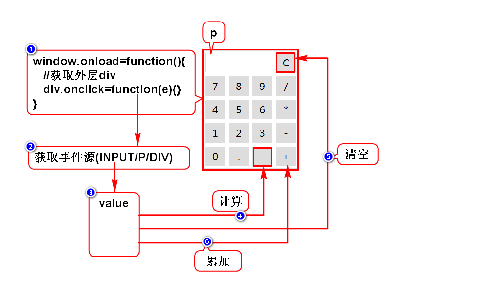

# 自定义对象
## 1.直接量(JSON)
- var stu = {"name":"zhangsan","age":25};
- {}表示对象，内含键值对
- key一般是字符串，value可以是任意类型的数据
- 简单

## 2.构造器
### 2.1内置构造器
- new Date()
- new RegExp()
- new Function()
- new Object()

### 2.2自定义构造器
- 声明构造器
- new 构造器()
- 直观

> JS中用来new的函数就是构造器

# 事件
## 事件概述
### 什么是事件
- 是用户操作网页的动作
- 是JS调用的时机

### 分类
- 鼠标事件：操作鼠标触发
- 键盘事件：操作键盘触发
- 状态事件：某条件达成时自动触发

## 事件定义的方式
### 1.直接定义
- 在标签上直接声明事件及其绑定的函数
- onclick="f1();"

### 2.后绑定(低耦合)
- 在页面加载后，通过JS为节点定义事件及绑定函数
	
        window.onload = function() {
			var obj = document.getXXX();
			obj.事件 = function() {}
        }

## 事件取消的方式
- 在事件内 return false

## 事件对象
### 什么是事件对象
- 事件触发时，浏览器会自动创建一个对象封装相关信息
- 通过此事件对象event可以获取坐标、按键等信息

### 如何获取事件对象
1. 直接定义事件时，手动传入event
2. 后绑定事件时，JS会自动传入event

## 事件处理机制(冒泡机制)
1. 事件是由内向外传播的
2. 可以通过JS代码取消传播

## 冒泡机制的作用
1. 可以用来简化事件的定义
2. 可以将子元素上多个事件简化为父元素上一个事件
3. 此时需要获取事件源判断事件发生的部位

# 计算器
