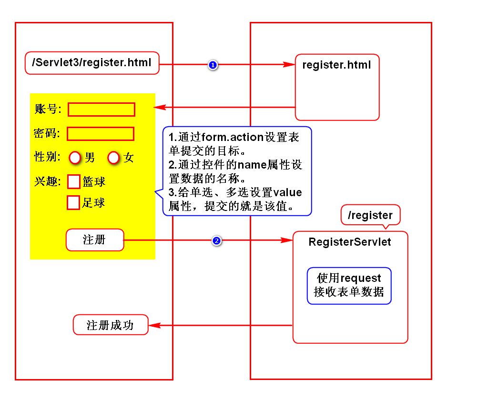
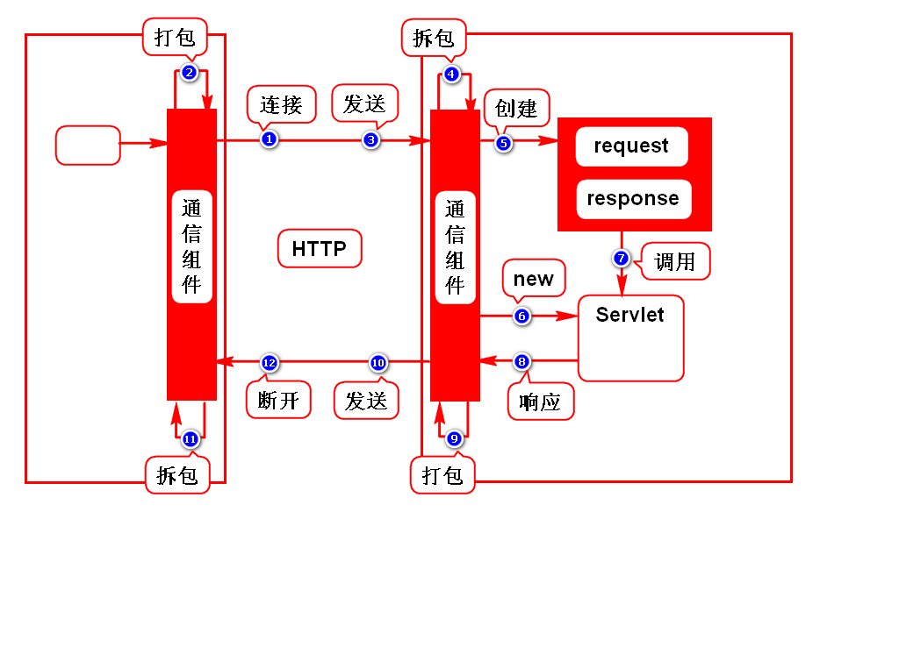
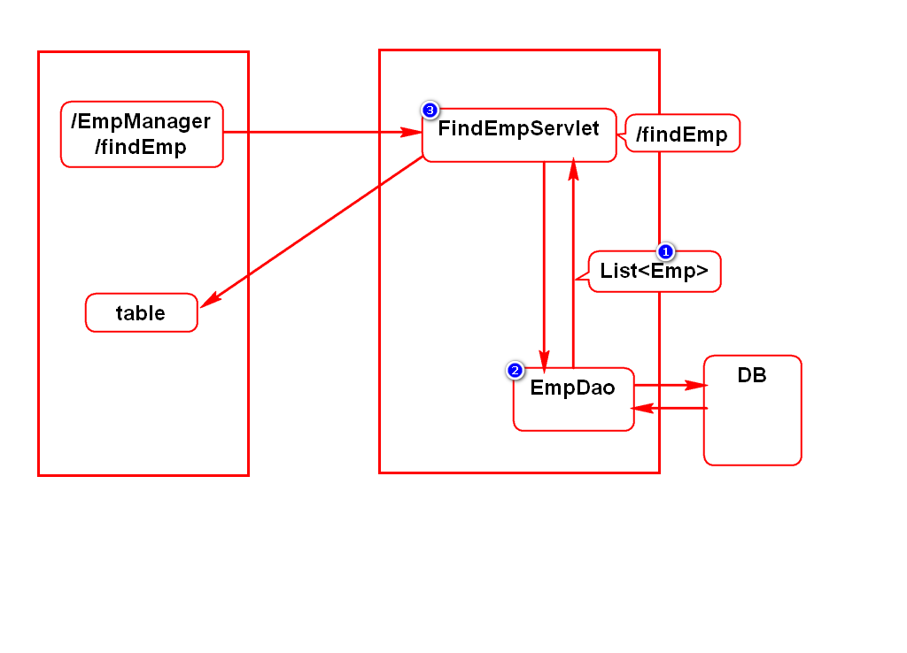

# 注册案例

# Servlet原理

# 请求方式
## 什么请求方式
- 浏览器向服务器传递数据的方案(策略)
- 需要掌握2种方式：GET、POST

## GET
- 采用路径传参
- 参数在传递过程中可见，隐私性差
- 可以传递的参数较小
> 默认所有的请求都是GET请求

## POST
- 采用实体内容传参
- 参数在传递过程中不可见，隐私性好
- 传递参数的大小不受限制
> 表单上加method="post"则为POST请求

## 使用场景
- 向服务器索取(查询)数据时用GET
- 向服务器提交数据时用POST

# 乱码问题解决方案

# 查询员工

# 增加员工

# 2天重点
1. Servlet使用步骤
2. Servlet运行原理
3. 请求和响应乱码解决方案

# 补充
## 什么是JavaBean
满足如下规范的类： 
1. 有package
2. 有默认构造器
3. 实现序列化接口Serializable
4. 有get和set方法