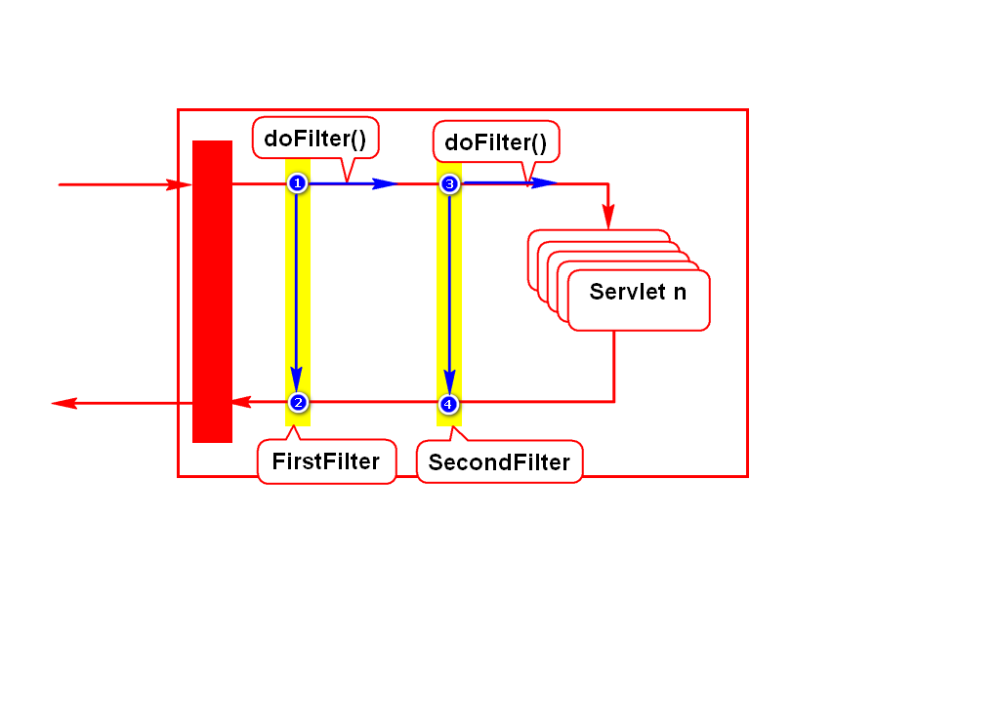
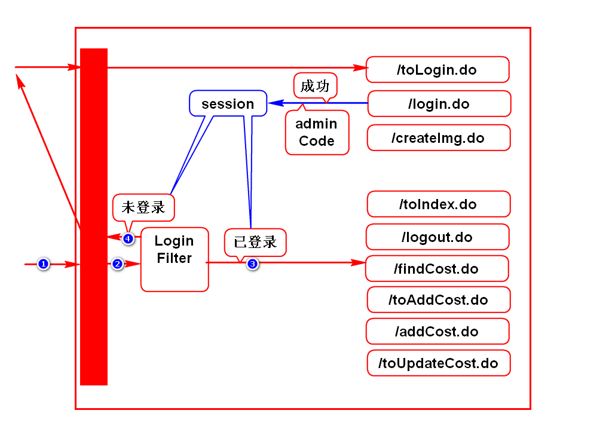

# 验证码

# cookie和session的作用
## 通俗的理解
- 他们可以按照如下要求存储数据：
- 多个Servlet可以共用此数据。
- 多个请求之间可以共用此数据。
- 每个浏览器单独存一份数据，是隔离开的。

## 典型的场景
- 登录时存储账号等数据
- 后续其他功能使用这份数据
- 本质的目的是为了让服务器记住浏览器

## 专业的理解
- HTTP协议是无状态协议，即服务器默认记不住浏览器
- cookie和session就是弥补这个问题，用来记录状态的
- cookie和session是用来进行状态管理的
> 状态就是数据，能够标识浏览器来过的数据。

# Filter

# 登录检查
