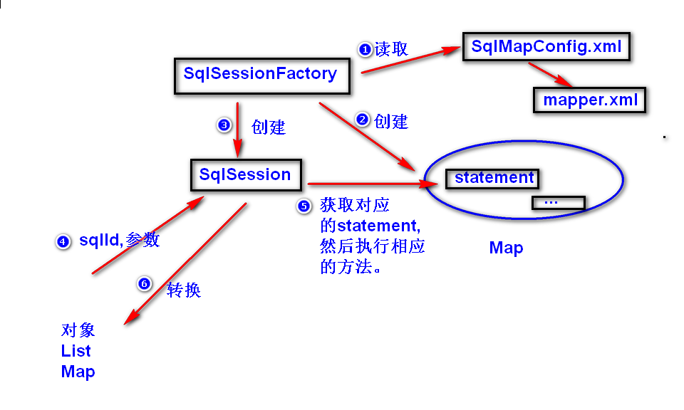
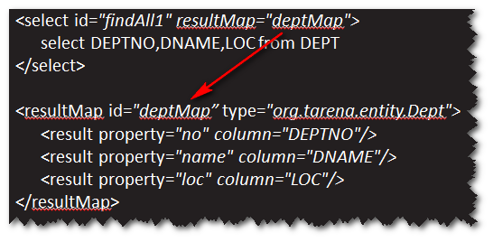

# mybatis
## mybatis是什么?
开源的持久层框架。 

	hibernate  可以不写sql 性能稍差 代码简洁 生成的sql难维护
	mybatis   要写sql 性能良好 代码简洁
    jdbc      要写sql 性能最好 代码麻烦    

## 第一个程序
step1. 导包 
mybatis.jar,jdbc driver.jar 
step2. 添加配置文件。 
 
注：配置文件里面主要包含两部分信息，一是数据库的连接参数，二是
映射文件的位置 
step3. 实体类 
注：实体类的属性名必须与表的字段名一致(名称相同，大小写无所谓)。 
step4. 映射文件 
 
注：记得将映射文件的位置添加到配置文件。 
step5.利用mybatis提供的api来访问数据库。 
## 工作原理
 

练习: 
使用mybatis完成部门表的增删改查操作。 
    create table dept(
    	id number(8) primary key,
    deptName varchar2(20),
    	addr varchar2(50)
    );
    create sequence dept_seq;

## 返回Map类型的值
### SqlSession默认会将查询出来的记录中的数据放到一个Map
对象里(字段名作为key,字段值作为value)。接下来，会将Map中
数据添加到对应的对象里面。 

## 实体类的属性名与表的字段名不一致，如何处理?
方式一: 用别名,比如 
SELECT id empNo,ename name,age FROM emp 
方式二：使用`<resultMap>`元素。 
 

## Mapper映射器
### Mapper映射器的作用： 
	依据Mapper接口(DAO接口)自动生成对应的DAO。
### 如何使用?
step1. 写一个Mapper接口(DAO接口),该接口中的方法必须
与映射文件中的sql定义一致。 
a. 方法名与sql的id一样。 
b. 方法的参数类型与sql定义中的参数类型一致。 
c. 方法的返回类型与sql定义中的返回类型一致。 
step2. 修改映射文件，namespace必须等于Mapper接口的完整的名称。 
step3. 调用SqlSession的getMapper方法。该方法会返回一个实现了
对应Mapper接口要求的对象。 

练习: 
使用Mapper映射器完成部门表的增删改查操作。 

   

	

